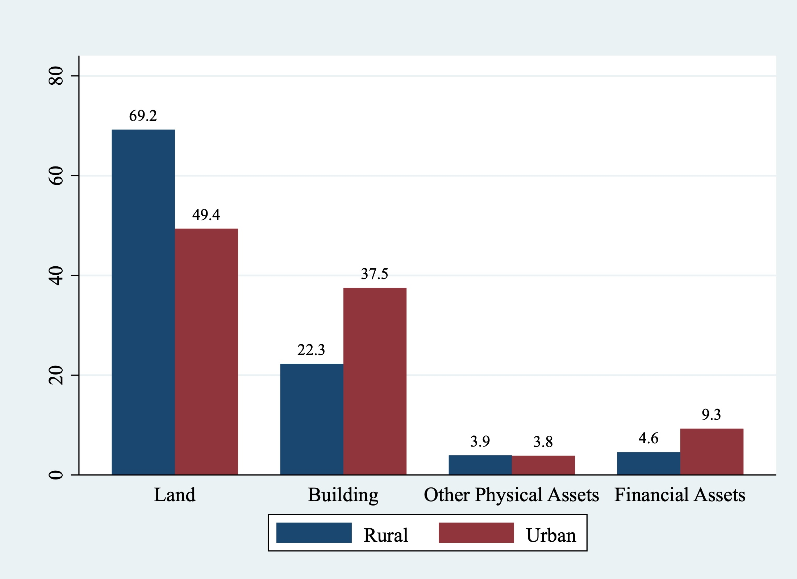
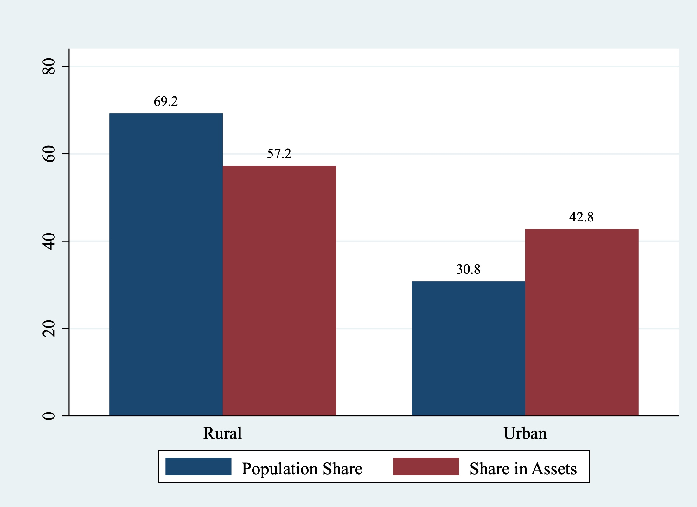
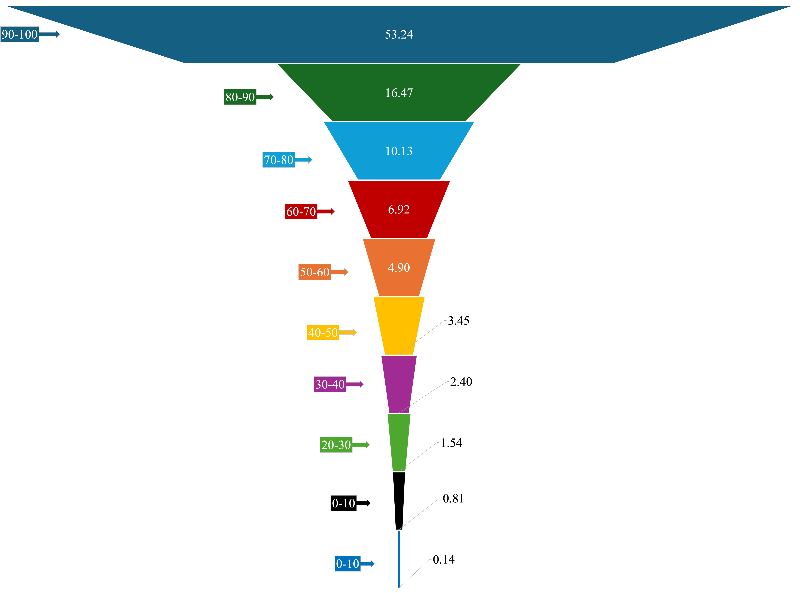
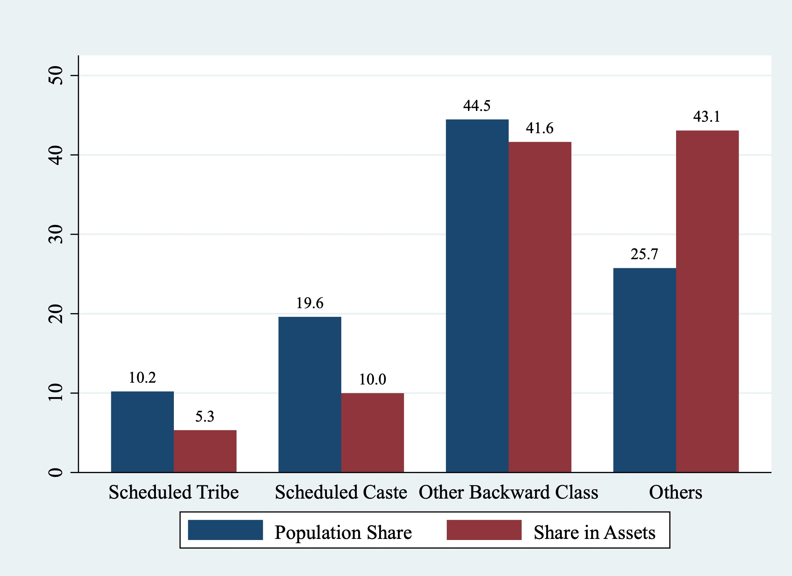
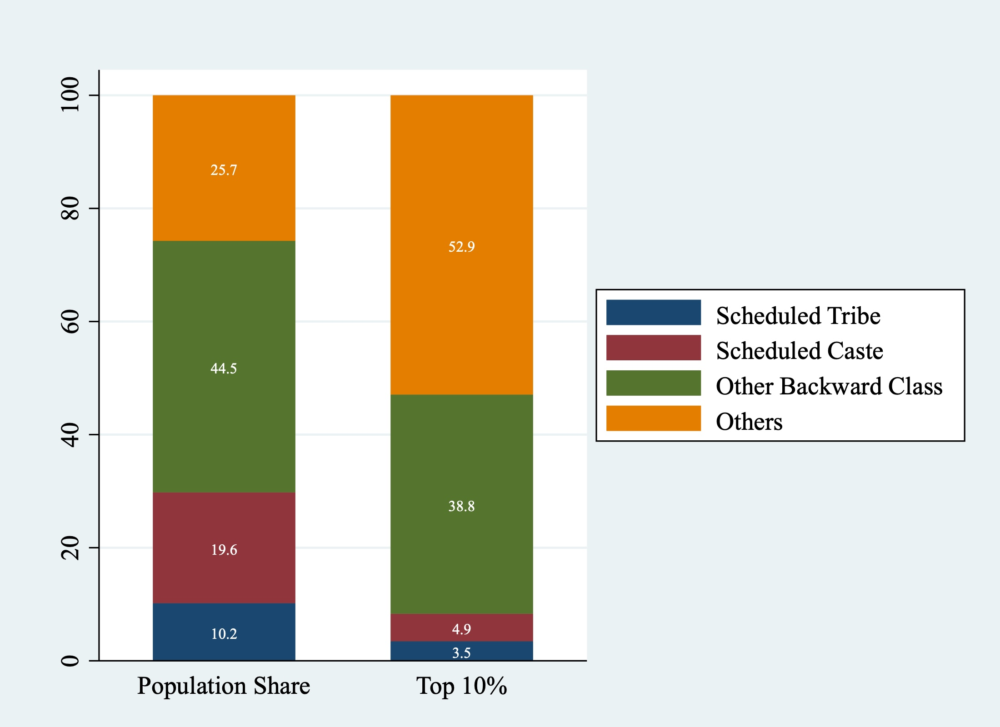

The recent visit of Professor Thomas Piketty, a renowned French economist and leading expert on inequality, has reignited public debate on the issue in India. His proposal to introduce a wealth tax on the super-rich and his assertion that reducing inequality can drive India’s economic growth have intensified the already existing debate around progressive taxation and wealth redistribution. In the first part of its ***Inequality Series***, Tiny Data Tales examines the disparity in household asset distribution, using the All India Debt and Investment Survey (AIDIS), 2019.

The AIDIS is a sample survey conducted by the National Sample Survey Organisation (NSSO) covering the entire country and is the major source of data on assets (physical and financial) as well as loans. In this article we look into the holding of assets by different socio-economic groups. Figure 1 shows the proportion of various types of assets in rural and urban areas. Even to this day, land and buildings constitute the majority of the assets accounting for 91.5% and 89.7% of the total assets in rural and urban areas respectively. Financial assets constitute only 4.6% of total assets in rural areas, compared to 9.3% in urban areas. 

***Figure 1: Percentage Share of Different Asset Groups in Total Assets***

## Rural-Urban Asset Distribution

In Figure 2, we examine the rural-urban distribution of assets in India. More than two-thirds of the Indian population still reside in rural areas. However, their share of the total assets, at 57.2%, is less than their share of the population. In contrast, while 30.8% of the population lives in urban areas, they own 42.8% of the total assets. Thus, the asset-to-population share ratio is greater than one for urban areas (1.38), while it is less than one for rural areas (0.82). Thus, it is clear that there is a concentration of wealth in urban areas. 

***Figure 2: Rural-Urban Distribution of Assets in India***

## Concentration at the Top

Next, we will look at the asset distribution by asset deciles group. We first break down the entire population into 10 deciles, each containing 10% of the population. The proportion of total assets held by each of the 10 deciles is analysed in Figure 3. 
We find that the poorest 10% of the population holds 0.14% of the total assets, while the richest 10% holds 53.24% of the total assets. Thus, the top 10% not only holds more than 50% of the assets, but they also hold 380 times the wealth of the bottom 10%. Even the 9th decile holds 3.23 times less than the top decile. Each of the bottom 7 deciles holds less than 10% of the total assets, which is below their population share. Thus, the extreme concentration of assets at the topmost decile shows that a small proportion of the population controls the majority of the assets.  

***Figure 3: Distribution of Assets by Decile Group in India***

## Caste and Asset Concentration

Indian society is stratified along the axes of caste and class. To fully understand inequality, it is essential to analyze the share of assets held by different social groups. The AIDIS divides the population into four social groups: Scheduled Tribes (STs), Scheduled Castes (SCs), Other Backward Classes (OBCs), and Others (mainly historically privileged castes). 
Figure 4 shows the percentage share of assets held by these different social groups alongside their percentage share of the total population. STs constitute 10.2% of the population, but their share of assets is only 5.3%. Similarly, SCs makeup 19.6% of the population, yet their share of assets is 10%. Thus, the share of total assets held by both SCs and STs is nearly half of their share in the population. While the population share of OBCs is 44.5%, their share of total assets is 41.6%. Although OBCs perform better than SCs and STs, their share of assets is still less than their population share. As is evident, ‘Others’ is the only category whose share of assets is greater than their share of the population. While they constitute only 25.7% of the total population, their share of assets is 43.1%, which is even higher than the asset share of OBCs. The asset-to-population share ratio is 1.7 for “Others” social groups indicating a concentration of assets among the historically privileged castes.   

***Figure 4: Distribution of Assets by Social Group in India***

## Caste Analysis of the Top 10%

Figure 5 provides a breakdown of population share in the top decile of asset holders across the social groups in India. The proportion of STs in the top decile is 3.5%, despite constituting 10.2% of the population. Similarly, Scheduled Castes, with a population share of 19.6%, constitute only  4.9% when it comes to the population owning top 10% of assets. Other Backward Classes (OBCs) account for 38.8% of the population in the top decile, which is slightly less than their population share of 44.5% in the country as a whole. In contrast, the “Others” category, representing 25.7% of the population, constitute a disproportionate 52.9% of the top decile. This demonstrates significant inequalities in asset distribution, with marginalized groups like SCs and STs being vastly underrepresented among the top asset decile. 

***Figure 5: Social Group Breakdown of the Top 10% of Asset Holders***

Thus, there is not only a concentration of assets at the top, but these assets are predominantly owned by historically privileged castes. AIDIS 2019 data shows that the Indian economy is characterized by wide-spread rural - urban division and socio-economic inequality in the ownership of assets.