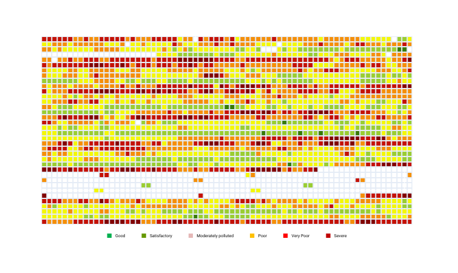
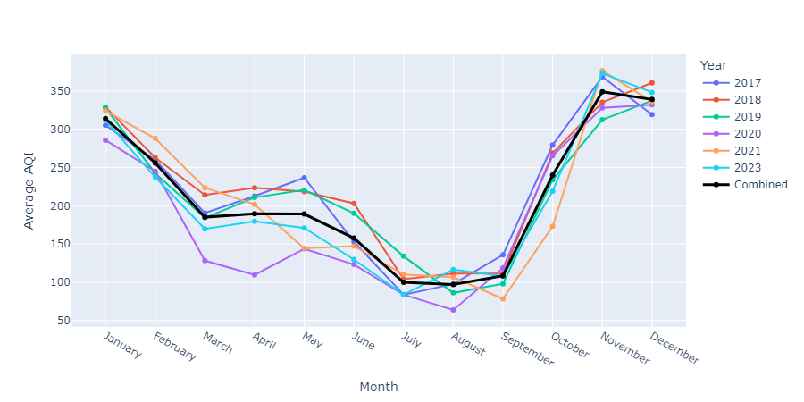
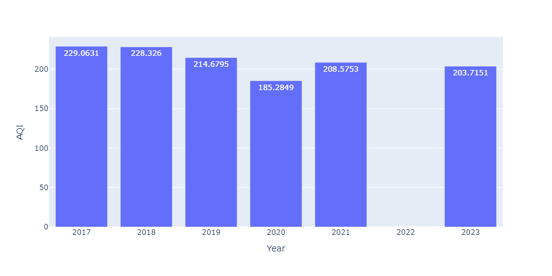

Every year around this time, Delhi finds itself engulfed in an intense debate around its worsening air quality. It's around this time that a thick, dark smog can be clearly seen and felt, sparking debates and discussions across media and political corridors. Beyond the headlines, public outrage, and political negligence lie a story told best by data. After a month or two, the anger subsides, and the issue is passed off as a seasonal inconvenience caused by natural factors beyond human control. So, we analysed Delhi's AQI data to make a sense of the urgency of the situation and understand how much of it is temporary, how much is permanent.

## Understanding the Air Quality Index (AQI)
The air is composed of various gases, some good, others bad. It also gets contaminated by a number of solid and liquid (though invisible to the naked eye) and gaseous pollutants as a result of certain human activities. These solid and liquid pollutants, or particulate matter (PM), are the most harmful. Thus, the air around us is a complex composition of a number of components. The Air Quality Index (AQI) is a standardised measure that simplifies complex air quality data into a single number that is easy to interpret. The standardisation, however, is not universal and different countries have their own measuring criteria and indices. 

In India, a National Air Quality Index (NAQI) was launched in 2014. The National Air Quality Index (AQI) flattens complex air quality data of eight pollutants into a single number ranging from 0-500 with levels categorised from "Good" to "Severe." The guidelines also prescribe a colour scheme and health risks associated with each category to easily visualise and understand the numbers.

<table>
	<caption>Table 1: India's AQI scale. Aadapted from "National Air Quality Index" (2014)</caption>
    <thead>
        <tr>
			<th>AQI Range</th>
			<th>Categorisation</th>
			<th>Color Code</th>
			<th>Associated Health Impacts</th>
		</tr>
    </thead>
	<tbody>
		<tr>
			<td>0&ndash;50</td>
			<td>Good</td>
			<td style="background-color: #00B050;"></td>
			<td>Minimal Impact</td>
		</tr>
		<tr>
			<td>51&ndash;100</td>
			<td>Satisfactory</td>
			<td style="background-color: #669900;"></td>
			<td>May cause minor breathing discomfort to sensitive people.</td>
		</tr>
		<tr>
			<td>101&ndash;200</td>
			<td>Moderately polluted</td>
			<td style="background-color: #E5B8B7;"></td>
			<td>May cause breathing discomfort to people with lung disease such as asthma, and discomfort to people with heart disease, children and older adults.</td>
		</tr>
		<tr>
			<td>201&ndash;300</td>
			<td>Poor</td>
			<td style="background-color: #FFC000;"></td>
			<td>May cause breathing discomfort to people on prolonged exposure, and discomfort to people with heart disease</td>
		</tr>
		<tr>
			<td>301&ndash;400</td>
			<td>Very Poor</td>
			<td style="background-color: #FF0000;"></td>
			<td>May cause respiratory illness to the people on prolonged exposure. Effect may be more pronounced in people with lung and heart diseases.</td>
		</tr>
		<tr>
			<td>401-500</td>
			<td>Severe</td>
			<td style="background-color: #C00000;"></td>
			<td>May cause respiratory impact even on healthy people, and serious health impacts on people with lung/heart disease. The health impacts may be experienced even during light physical activity.</td>
		</tr>
	</tbody>
</table>

## Data
Our analysis relies on daily AQI data sourced from the [Central Pollution Control Board (CPCB)](https://cpcb.nic.in/), spanning 2017 to 2023. With over 2,000 days of readings, it can offer a robust snapshot of Delhi's air quality trends. However, some inconsistencies can be noted in the data. For 2022, weirdly enough, data is available only for the first two days of each month. As a result, 2022 was excluded from some of the analyses. Also, the AQI readings stop at 500, but AQI levels of even 1000+ have been reported frequently. 

## Daily AQI

*Figure 1: Daily AQI heatmap (2017-23)*

Figure 1 is a heatmap of the daily AQI for the period 2017-23, for which the daily AQI data is available on CPCB. Each cell represents a day, and the colour of the cell indicates its AQI category as per the CPCB guidelines. So, a green cell means the AQI that day belongs to the "Good" category, and a dark red would mean "Severe" air quality. The cells in white are those for which no data is available. As can be seen, for most days in 2022, data is missing.

## Monthly Patterns
Delhi's AQI fluctuates significantly throughout the year, as can be seen in Figure 2. But, over the years, AQI levels during a given month remain more or less the same. As mentioned earlier, due to lack of data for 2022, we have skipped it from our analysis. During the winter months of November to January, AQI peaks at alarming levels at around 350, falling in the "Very Poor" category. Colder temperatures trap pollutants near the ground, and slow air currents make it hard for pollutants to escape. November is the most polluted month of the year.

*Figure 2: Montlhy Avg. AQI (2017-21, 2023)*

Delhi experiences its cleanest air from July to September, after which AQI levels spike sharply. Even during these cleanest months, AQI levels remain around 100, making clean air (below 50) a rare occurrence in the city. This improvement coincides with the monsoon season, when rainfall helps clear particulate matter. So, although seasonal activities do contribute to spiked levels during winter, there is considerable scope for improvement in everyday life in Delhi.

## Yearly Trends

*Figure 3: Yearly Avg. AQI*

Analysing the average yearly AQI reveals a grim picture. Since 2017, the yearly average has consistently surpassed 200, indicating "Very Poor" air quality by Indian standards. For context, the World Health Organization (WHO) recommends that PM2.5 levels—one of AQI's major components—should not exceed an annual average of 5 µg/m³. Delhi's air quality far exceeds this benchmark. Interestingly, 2020 emerged as the cleanest year in the dataset, the only year with AQI below 200. This could be explained by the fact that 2020 was the year when, for the most part, a complete lockdown was observed during the COVID-19 pandemic. Lockdowns drastically reduced vehicular traffic, industrial activity, and construction, providing a rare glimpse of what cleaner air could look like. Yet, this improvement was short-lived; 2021 marked a return to pre-pandemic pollution levels.

## The Human Cost of Pollution
The implications of Delhi's air quality extend far beyond statistics. Prolonged exposure to high AQI levels is linked to respiratory illnesses, cardiovascular problems, and even shortened life expectancy. According to a [study](https://epic.uchicago.in/indians-lose-5-years-life-to-air-pollution-delhi-worst-at-12-years-chicago-university-study/) by the Energy Policy Institute at the University of Chicago, Delhi residents are losing 12 years of life expectancy due to sustained exposure to air pollution. For vulnerable populations, including children and older people, the stakes are even higher. 

## Conclusion
It is beyond any shred of doubt that the AQI levels in the winter months are exceptionally concerning and that the seasonal factors do contribute to the alarming situation. However, for most of the year, the air quality remains unclean and dangerous. Instead of selective uproar and mud-slinging, there is a need for a comprehensive and sustained environmental protection policy. As a reminder, in the last 7 years (2180 days to be exact for which data is available), Delhi experienced AQI levels below 50, a "Good" air quality rating, in just 11 days, most of which were in 2020 – the lockdown year.

## Bibliography
- Central Pollution Control Board. “National Air Quality Index,” Accessed December 3, 2024. http://app.cpcbccr.com/ccr_docs/FINAL-REPORT_AQI_.pdf.

- “India | OpenAQ - AQI Hub.” Accessed December 4, 2024. https://aqihub.info/indices/india.

- Raha, Ashirbad. “Indians Lose 5 Years’ Life to Air Pollution, Delhi Worst at 12 Years: Chicago University Study.” EPIC-India (blog), August 31, 2023. https://epic.uchicago.in/indians-lose-5-years-life-to-air-pollution-delhi-worst-at-12-years-chicago-university-study/.

- Ravindra, Khaiwal, Vikas Singh, and Suman Mor. “Why We Should Have a Universal Air Quality Index?” Environment International 187 (May 2024): 108698. https://doi.org/10.1016/j.envint.2024.108698.