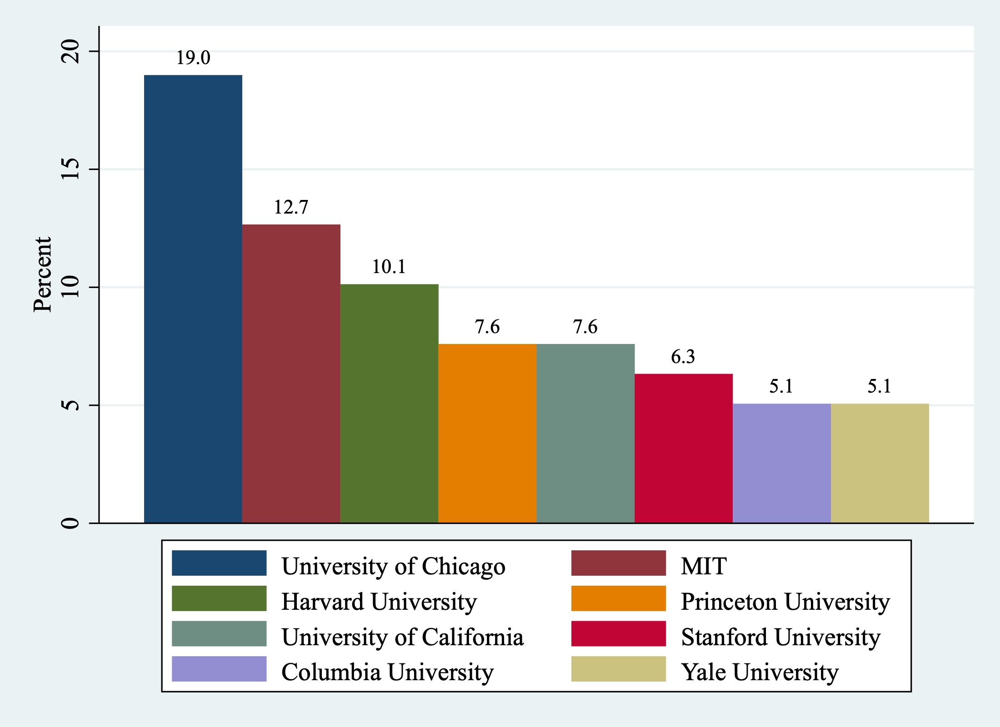

In the 56 years since its inception in 1969, ‘The Sveriges Riksbank Prize in Economic Sciences in Memory of Alfred Nobel’, popularly known as the Nobel Prize in Economics, has been awarded to 96 scholars. In this article, we examine the gender and geographical location of the recipients using data from the [official website](https://www.nobelprize.org/prizes/lists/all-prizes-in-economic-sciences/ ) of Nobel prize . The study finds that the Nobel prize has historically belonged to men affiliated to institutions in the United States of America, with no representation from third world countries. Rare instances have existed were scholars born in the global south have received the award, but in 84% of the cases, they had by then migrated to the USA and in 12% of the cases to the United Kingdom. There are only a few departments like the University of Chicago (US) and Massachusetts Institute of Technology (MIT), Cambridge, US where the award has gone multiple times, thus indicating a close community of researchers engaged in research which has time and again attracted the selection committee (Smith & Ryan, 2024).

While we have data on the gender and country of birth for all scholars, the data on the affiliation during the time of the award is missing for two recipients of the prize: Gunnar Myrdal (1974) and Friedrich von Hayek (1974). In cases where in the laureate was associated to two departments at the same time, the first mentioned affiliations have been taken here. 

## Gender Imbalance

Till date, there have been only three women who have received the prize: Elinor Ostrom (2009), Esther Duflo (2019), and Claudia Goldin (2023). All three women scholars were affiliated to departments in the US at the time of the receipt of the awards, and while two of them were born in US, one was born in France.

**Figure 1: Gender Distribution of the Award Winners**

## The US Dominance

US (male 80.9% and female 3.2%) accounts for about 84% of the prizes while US and Europe (including UK) account for 97.87% of the prizes with the prize never been received by a department in the third world.

**Figure 2: Country of the Department to which the winner was affiliated**

## Migration to the US

We see that there is a larger distribution or spread as far as the countries of the award winners are concerned. 84% of the award winners who had changed countries, were affiliated to American departments when they received their award. The 3 awardees who moved to UK, moved from Cyprus, India, and Scotland, and as far as US is concerned, it had 3 Nobel laureates, whose birth countries were UK. Thus, it becomes clear that it is the US, and US alone which has been dominating the list of awardees and hence, setting the course of the debate.

**Figure 3: Movement from Country of Birth to the Country of Department**

## Departmental Concentration within the USA

This section uses data of the current affiliation of the scholar during the time of the award, to analyse the departments that had received the award. The same department being repeated time and again, increases the probability of a future laureate being associated in a close academic network to a past laureate. That networking that plays out in academia is well known; this section supports this already known fact (Freeman, Xie, Zhang, & Zhou, 2024).

**Figure 4: Distribution across departments in USA**

The Chicago School of Economics, the home department of Milton Friedman, which has been at the centre of debates, in the favour of free markets, has received the award the maximum number of times, close to 20% of the times the award went to a US academic, followed by MIT. Apart from US universities, University of Cambridge in UK is the only one that has received multiple awards. 

## References

- Smith, K., & Ryan, C. (2024, October 3). How to win a Nobel prize. Nature.

- Freeman, B. R., Xie, D., Zhang, H., & Zhou, H. (2024, 25 June). High and Rising       Institutional Concentration of Award-Winning Economists. NBER.
