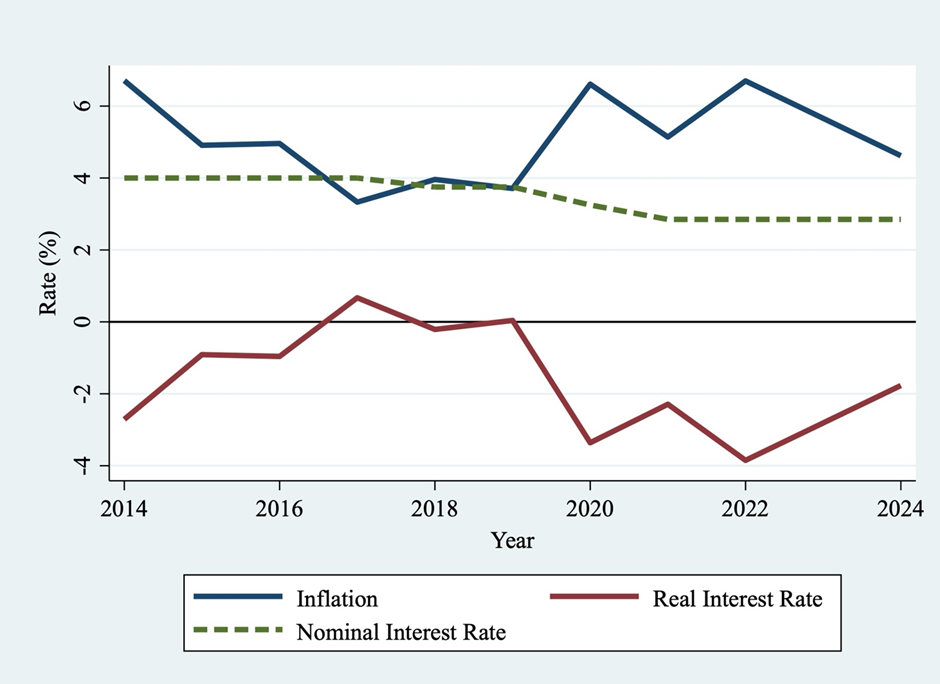

Most of us have a savings account in a bank to keep our money safe for future consumption. But does that really increase our ability to buy goods and services? It is this question that we are delving into in this article. But first, we need to understand the difference between nominal and real interest rate. The nominal interest rate is the rate a bank offers when you deposit money in a savings account or term deposit—or the rate it charges when you take a loan. Conversely, the real interest rates on deposits (or loans) reveal the true advantage of deposits in terms of gain in purchasing power (and the actual cost of loans in terms of loss in purchasing power). Real interest rates are the interest rate you get (or pay) after adjusting for inflation, that is, in terms of purchasing power.  

*Real interest rate = Nominal interest rate – Inflation*

Inflation measures the rise in the average price level during a given time period. It is calculated using indexes like CPI (Consumer Price Index) and WPI (Wholesale Price Index). This article uses inflation in terms of CPI since it explores the effect of real interest rate on the ability to consume. More specifically, inflation is calculated using CPI General index which is a weighted average of the various items used for consumption by households. The consumption basket considered for calculating CPI include the following groups of items: ‘Food and Beverages’, ‘Pan, Tobacco and Intoxicants’, ‘Clothing and Footwear’, ‘Housing’, ‘Fuel and Light’, and ‘Miscellaneous Items’.

Commercial banks offer and charge interest rates in nominal terms, but nominal interest rates tell only a part of the story. A nominal interest rate of 4% per annum (pa) in a savings account means that you will receive ₹4 on every ₹100 after the end of the one-year term. But is this ₹104 able to buy the same amount of goods and services that it did one year earlier? We use data on the interest rates from 2014 to 2024 from the Reserve Bank of India (RBI)<a href="#foot1">1</a> and on inflation from Ministry of Statistics and Programme Implementation (MoSPI) to answer this question.

## Savings Accounts and Term Deposits: Gains and Losses in Purchasing Power

The two most popular methods to save money in banks is through savings accounts and term deposits. While savings accounts offer easy access to funds with lower interest rates, term deposits lock in money for a set amount of time, typically offering higher interest rates but limited liquidity. The nominal interest rate on savings accounts has been falling throughout, but it remains positive. It was 4% in 2014 and has declined to 2.85% in 2024 while the inflation rate fell from 6.71% in 2014 to 3.71% in 2019 followed by a sharp rise to 6.61% in 2020 and it has remained above 4.5% henceforth. With nominal interest rate declining and high inflation rates, the real interest rate has mostly been negative between the two time periods. As is clear from figure 1, the real interest rate is negative for all years with the exception of 2017 and 2019. A negative real interest rate implies that a person is losing out on purchasing power by keeping money in savings account. The loss per ₹100 is indicated by the magnitude of the real interest rate, for example in 2022 the real interest rate was –3.85%, which implies that on a saving of ₹100 at a time when the bank was offering 2.85% nominal interest in 2022, people would receive ₹102.85 after a year, but this ₹102.85 is expected to buy goods worth only ₹96.15 after a year. Hence the loss per ₹100 in terms of purchasing power is expected to be ₹3.85, equal to the real interest rate. The actual loss in purchasing power will be equal to the nominal interest minus the inflation prevailing during maturity of the deposit. 

**Figure 1: Interest Rate (Nominal and Real) on Savings Accounts, 2014-2024**

Figure 2 discusses term deposits greater than 5 years. The nominal interest rate for the term deposits has declined from 8.80% in 2014 to 5.33% in 2022 before reaching back to 6.45% in 2024.  The real interest rates for term deposits hovered between 2.00% to 3.50% for the period 2014 to 2019 till it became negative in 2020 when the inflation shot up coupled by a fall in the interest rate. The real returns from even term deposits with the longest period (according to RBI) was negative for 2020, 2022, and 2023, being 0.03% in 2021. In 2024, it has reached 1.83%, which is still lower than the previous period. Unlike the savings accounts, term deposits are considered a form of investment and are expected to yield gains for parting with liquidity. However, our analysis suggests even long-term deposits<a href="#foot2">2</a> are unable to provide purchasing power gains that people expect. On the contrary, it even leads to losses if the inflation rates are higher than nominal interest rates.  

**Figure 2: Interest Rate (Nominal and Real) on Term Deposits (Greater than 5 Years), 2014-2024**

## Lending Rates and the Real Cost of Borrowing

Unlike the savings accounts and terms deposits, institutional borrowing allows individuals and corporations to borrow money at a given rate. The difference in interest earned from these is a major method for the banks to earn profit. Institutional borrowing requires bureaucratic paperwork and mortgage or Credit Information Bureau (India) Limited (CIBIL) scores, which is usually unavailable to the poorer majority of the population. Usually poor in rural India and agricultural households do not have access to such credits (Basu, 1997; Kumar et al, 2021). The nominal interest rate on borrowings has declined from 10.13% in 2014 reaching the lowest point in 2022 at 6.73% and has increased marginally to 8.30% in 2024. However, once adjusted with inflation real interest rates hardly cross the 5.50% mark with it being almost zero (0.03%) in 2022. 

Let us figure out what it means. In 2019, the nominal interest rate was 8.30%, so it appears that anyone who wanted to take a loan, for say five years would have had to pay the interest rate of 8.30% pa besides the principal. However, the real interest rate for the same year was 4.59%, which implies a loss in purchasing power of 4.59% as opposed to 8.30% in the first year of the borrowing. In all the remaining four years, the cost of the loan in terms of loss in purchasing power will be 8.30% minus the inflation rate of that year. Thus, increasing inflation rate leads to gain for debtors. But as discussed earlier, these loans are not available for the majority of the population. 

**Figure 3: Lending Rate (Nominal and Real), 2014-2024**

## In Conclusion

In figure 4, the real interest rates on savings accounts, term deposits and on lending are given. When the inflation rate is high, it is loss of purchasing power for depositors and a gain for borrowers. Majority of the people, largely the poorer sections of the society have at most a savings account where they keep some balance in the hope of some positive return, but the study shows that people lose out on purchasing power despite saving. Thus, nominal interest rates provide an eyewash of economic gain, but in actual terms, one loses. The people how can benefit from this scenario are people with access to institutional credits, the larger the access, the larger the gain. We find inflation takes wealth away from one class of the citizen to help the other class to gain at the same time. 

**Figure 4: Real Interest Rate on Savings Accounts, Term Deposits and Lending, 2014-2024**

This article voices for higher interest rates in saving and term deposits and a control over inflation. A large section of the population depends on interest rates on their lifelong savings, especially after retirement. The commercial banks do offer higher interest rates for senior citizens, but these need to be increased further, to make it positive in terms of purchanging power gains. 

## Bibliography

- Kumar, A, Das, R, KS, A, Bathla, S, & Jha, G K (2021). Examining institutional credit access among agricultural households in Eastern India: Trends, patterns and determinants. _Agricultural Finance Review_, 81(2), 250-264.
- Basu, S (1997). Why institutional credit agencies are reluctant to lend to the rural poor: A theoretical analysis of the Indian rural credit market. _World Development_, 25(2), 267-280. 
 
---
#### Footnotes

1 RBI uses data from 5 major banks to calculate the interest rates.

2 RBI classifies term deposits into three categories based on the lock in period: 1-3 years, 3-5 years and above 5 years. For our analysis we use the above 5 years category since these offer the maximum nominal interest rates.
 